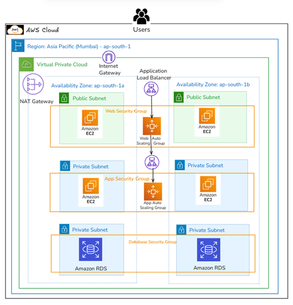
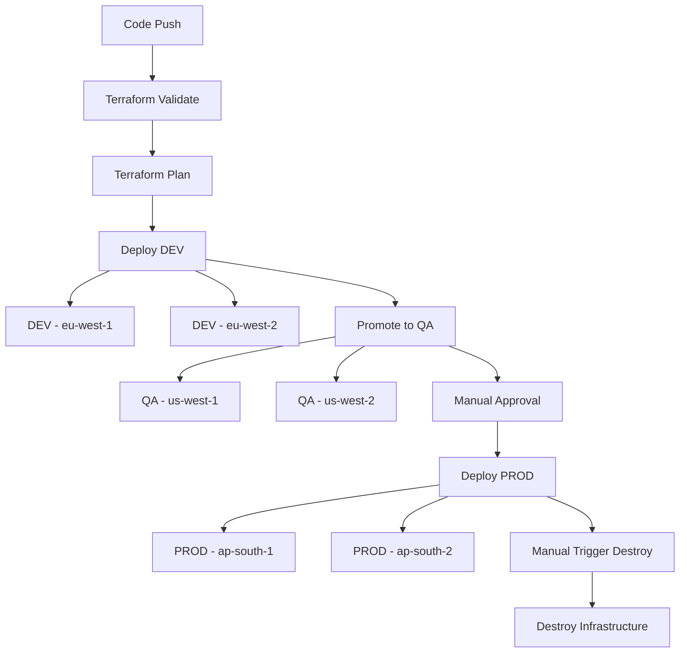

# 🚀 Production-Grade Multi-Region AWS 3-Tier Platform (Terraform + CI/CD)


This project demonstrates a **production-ready, highly available AWS infrastructure** built using Terraform and automated with GitHub Actions.

It simulates real-world DevOps practices including:
- 🌍 Multi-region high availability deployment  
- 🏗️ Multi-environment promotion strategy (dev → qa → prod)  
- ⚙️ Fully automated CI/CD pipelines (GitHub Actions)  
- 🔐 Secure and scalable cloud architecture  
- ♻️ Infrastructure lifecycle management (create & destroy)  

> 💡 Designed to reflect real-world production systems with scalability, security, and automation at its core.

---

# 📈 Key Achievements

- 🚀 Reduced infrastructure deployment time from hours to **<15 minutes**  
- ⚡ Improved operational efficiency by **70–80%** using IaC  
- 🌍 Enabled multi-region deployments with parallel execution  
- 🔐 Enhanced security using private subnets and controlled access  
- ♻️ Automated full infrastructure lifecycle (provision + destroy)  
- 📦 Eliminated environment inconsistencies using standardized CI/CD workflows  

---

# 🛠️ Tech Stack

- **Cloud**: AWS (EC2, VPC, RDS, ALB, Auto Scaling)  
- **IaC**: Terraform (Modules, Remote State – S3)  
- **CI/CD**: GitHub Actions  
- **Scripting**: Bash  
- **Architecture**: 3-Tier, Multi-Region, Highly Available  

---

# 📑 Table of Contents

- Architecture Overview  
- Deployment Strategy  
- Deployment Flow  
- Project Structure  
- Security Design  
- Prerequisites  
- Deployment Steps  
- Destroy Resources  

---

# 🧱 Architecture Overview

The infrastructure follows a **3-tier architecture pattern**:

- **Web Tier** → Public-facing EC2 instances behind ALB  
- **App Tier** → Private EC2 instances  
- **Database Tier** → RDS (primary + read replica)  

## 📊 Architecture Diagram

<p align="center">
  
</p>

---

# ⚙️ Deployment Strategy

## 🔹 Multi-Region Deployment

| Environment | Regions |
|------------|--------|
| DEV        | eu-west-1, eu-west-2 |
| QA         | us-west-1, us-west-2 |
| PROD       | ap-south-1, ap-south-2 |

---

## 🔹 Multi-Environment Deployment

| Environment | Deployment Type |
|------------|----------------|
| DEV        | Automatic |
| QA         | Promotion from DEV |
| PROD       | Manual Approval |

---

## 🔹 CI/CD Workflow Design

This project uses **GitHub Actions reusable workflows**.

### 🔸 Resource Creation
- Trigger: `push`  
- Steps: init → validate → plan → apply  
- Deploys across multiple regions in parallel  

### 🔸 Resource Destruction
- Trigger: `workflow_dispatch`  
- Safely destroys infrastructure using reusable workflows  

---

# 🚀 Deployment Flow



---

📁 Project Structure

```
.
├── root-module
│   ├── terraformblock.tf
│   ├── provider.tf
│   ├── main.tf
│   ├── variables.tf
│   ├── outputs.tf
│   ├── datasource.tf
│   ├── locals.tf
│   ├── amzninstall.sh
│   ├── dev.tfvars
│   ├── qa.tfvars
│   └── prod.tfvars
│
├── vpc-module
│   ├── vpc.tf
│   ├── igw.tf
│   ├── subnets.tf
│   ├── route_tables.tf
│   ├── subnets_association.tf
│   ├── eip.tf
│   ├── natgw.tf
│   ├── datasource.tf
│   ├── variables.tf
│   └── outputs.tf
│
├── sg-module
│   ├── main.tf
│   ├── variables.tf
│   └── outputs.tf
│
├── ASG-module
│   ├── load_balancer.tf
│   ├── target_group.tf
│   ├── launch_template.tf
│   ├── auto_scaling_group.tf
│   ├── variables.tf
│   └── outputs.tf
│
├── .github/workflows
│   ├── terraform-resource-creation-main-pipeline.yml
│   ├── terraform-resource-creation-reusable-pipeline.yml
│   ├── terraform-destroy-resources-main-pipeline.yml
│   └── terraform-destroy-resources-reusable-pipeline.yml
│
└── assets
    └── architecture.png
```

---

🔐 Security Design
- Private subnets for application and database layers
- Security groups restricting inbound/outbound traffic
- No direct access to backend services
- Controlled production deployments via manual approvals
- Secrets securely managed using GitHub Secrets

---

🔧 Prerequisites
- AWS Account
- IAM User with required permissions
- GitHub Secrets configured
- Terraform (optional locally)

---

# 🚀 Deployment Steps
## 🪪 Step 1: Create Key Pair

```bash
ssh-keygen -t rsa -b 4096 -f terraform-project-key
```
---

## 🔐 Step 2: Configure GitHub Secrets

- AWS_ACCESS_KEY_ID
- AWS_SECRET_ACCESS_KEY
- TF_STATE_BUCKET
- TF_VAR_PUBLIC_KEY
- DB_PASSWORD_DEV / QA / PROD

---

## 🧾 Step 3: Create `.tfvars` Files
- dev.tfvars
- qa.tfvars
- prod.tfvars

---

## 🚀 Step 4: Deploy Infrastructure

Push code → pipeline executes:

1. Validate  
2. Plan  
3. Deploy DEV  
4. Promote QA  
5. Manual approval → PROD  


Validate → Plan → Deploy DEV → QA → PROD

---

## 🧹 Destroy Resources

Run manually:

```
terraform-destroy-resources-main-pipeline.yml
```

---

# 💡 Key Highlights
- ✔ Multi-region per environment
- ✔ Promotion-based deployments
- ✔ Reusable CI/CD workflows
- ✔ Modular Terraform design
- ✔ Automated cleanup

---
